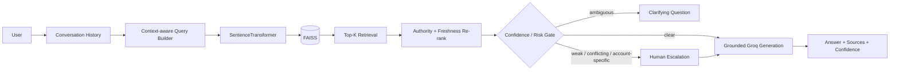

# LearnForge AI Support Assistant

Applied AI/LLM Engineer take-home submission by **Nuaima Saeed**.

A production-minded RAG customer-support prototype over the supplied LearnForge corpus: **15 FAQs, 10 policy/help-center articles, and 15 historical support tickets**. It is designed for the difficult parts of support RAG: stale documentation, contradictory evidence, multi-turn follow-ups, low-confidence retrieval, and cases that should be escalated instead of guessed.

## What it demonstrates

- Semantic retrieval with SentenceTransformers + FAISS.
- Metadata-aware re-ranking: current policy > FAQ > historical ticket when semantic scores are close.
- Multi-turn context for short follow-up questions.
- Grounded generation with Groq through its OpenAI-compatible API.
- Conservative extractive fallback if no API key is configured.
- Explicit stale/outdated guidance handling.
- Confidence/risk gate before generation.
- Clarification for ambiguous requests such as `Cancel my LearnForge.`
- Human escalation for weak evidence, account-specific cases, and purchase-specific promotional terms.
- Source IDs and confidence with every answer.
- Evaluation cases for answerable, stale, ambiguous, conflicting, and escalation scenarios.

## System design



More detail: [`docs/system-design.md`](docs/system-design.md). Data schema: [`docs/data-schema.md`](docs/data-schema.md).

## Why this is not just vector search -> LLM

The supplied data deliberately contains old instructions and unresolved support cases. A historical ticket can be semantically similar to a current policy while being a poor authority for a new user. Retrieval therefore uses cosine similarity as the main signal, with modest metadata priors:

```text
rerank_score = 0.78 * semantic_similarity
             + 0.14 * source_authority
             + 0.08 * freshness
```

Metadata breaks close ties without allowing an irrelevant policy to beat a much more relevant FAQ. The prompt separately instructs the model to treat text marked old, archived, obsolete, retired, or outdated as non-authoritative.

## Project structure

```text
app/                 RAG implementation, API, confidence and generation
data/                supplied 40-record LearnForge corpus
docs/                schema + architecture
eval/                labelled evaluation set + runner
scripts/             index build helper
tests/               parser, multi-turn and confidence tests
streamlit_app.py      chat demo
requirements.txt
.env.example
```

## Setup

Python 3.10+ is recommended.

```bash
git clone https://github.com/Nuaima/Edversity_Take-Home-Assignment_Nuaima.git
cd Edversity_Take-Home-Assignment_Nuaima
python -m venv .venv
# Windows: .venv\Scripts\activate
# macOS/Linux: source .venv/bin/activate
pip install -r requirements.txt
cp .env.example .env
```

Add a Groq API key to `.env`:

```env
GROQ_API_KEY=your_key_here
GROQ_MODEL=llama-3.3-70b-versatile
```

If the key is omitted, the app still runs in conservative extractive-fallback mode, so reviewers can inspect retrieval, confidence and escalation behavior without credentials.

### Run Streamlit

```bash
streamlit run streamlit_app.py
```

### Run FastAPI

```bash
uvicorn app.main:app --reload
```

Example request:

```bash
curl -X POST http://127.0.0.1:8000/chat -H "Content-Type: application/json" -d '{"message":"Can I get a refund after 10 days?","history":[]}'
```

## Important expected behaviors

| Query | Expected behavior |
|---|---|
| Can I get a refund after 10 days? | Use the current 14-day standard with its conditions. |
| An old article says refunds are only 7 days. | Explain that 7-day wording is outdated; prefer POLICY-02. |
| Can I download courses on my laptop? | Explain current offline support is for eligible mobile-app courses. |
| Cancel my LearnForge. | Ask what the user means instead of guessing. |
| I bought it 21 days ago but the promotion promised 30 days. | Explain standard policy and escalate purchase-specific terms. |
| My annual subscription page promised a 14-day refund after renewal. | Escalate conflicting purchase-specific wording. |

## Multi-turn handling

For short follow-ups, the retrieval query includes the previous user turn. Example:

```text
User: Can I get a refund for an individual course?
Assistant: ...
User: What if I bought mine 20 days ago?
```

The second retrieval query includes both the original refund topic and the 20-day follow-up. I chose deterministic context expansion for this prototype because it is cheap, observable and easy to test. A production system could use a dedicated rewrite model plus conversation summarization.

## Hallucination reduction

1. Closed corpus: generation receives only retrieved LearnForge context.
2. Source hierarchy: policies and FAQs outrank historical tickets when evidence is close.
3. Freshness rules: explicitly outdated/retired guidance is treated as non-authoritative.
4. Low generation temperature (`0.1`).
5. Confidence gate: weak retrieval is escalated before confident generation.
6. Conditional language: prompts forbid turning conditional policy into guarantees.
7. Account boundary: the model cannot claim it inspected an account, issued a refund, cancelled a subscription, or changed data.
8. Citations: source IDs are attached by application code, not invented by the model.

## Failure handling

### Low-confidence answers
If the strongest semantic evidence is below threshold, or aggregate confidence is weak, the system recommends human review instead of improvising.

### Stale data
The corpus itself contains stale-document warnings. Ingestion records deprecation signals, metadata ranking favors current authoritative sources, and the generation prompt treats old/archived/obsolete/retired instructions as non-authoritative. In production I would version documents and filter on `is_current`.

### Bad retrieval
If only historical tickets support a policy-style question, confidence is capped. In production I would add hybrid BM25 + dense retrieval and a cross-encoder reranker.

### Conflicting evidence
The assistant does not resolve purchase-specific contradictions requiring facts outside the KB. Promotional guarantees and plan-specific subscription wording are routed to Support with the general policy presented only as background.

### LLM/provider failure
Without an API key, the system falls back to a conservative extract from the strongest retrieved source. A production service would apply timeouts, retries, metrics and alerting around provider failures.

## Evaluation plan

`eval/eval_dataset.json` includes 12 representative cases across current policy, stale docs, ambiguity, billing, accessibility and escalation.

Run:

```bash
python eval/evaluate.py
```

The automated runner measures **Retrieval Hit@3** and **Escalation accuracy**.

For answer quality I would maintain a human-labelled test set and track:

- answer correctness
- groundedness
- hallucination rate
- citation precision
- retrieval Recall@K
- escalation precision and recall
- clarification accuracy

For a stronger offline evaluation, I would use two human annotators on a stratified set (routine, stale, conflict, multi-turn, unanswerable), adjudicate disagreements, and optionally use an LLM judge as an assistant rather than the sole ground truth.

## Trade-offs

### FAISS vs pgvector / managed vector DB
**Chosen:** FAISS because the corpus has only 40 records, it is free, fast and reproducible. **Production:** PostgreSQL + pgvector is a natural next step when persistence, metadata filtering, backups and access control matter.

### MiniLM vs paid embeddings
**Chosen:** `all-MiniLM-L6-v2` because it is local, free and sufficient for a tiny English support corpus. **Production:** benchmark embedding candidates on a labelled retrieval set and select by Recall@K, latency and cost.

### Simple re-ranking vs cross-encoder
**Chosen:** transparent similarity + metadata weighting because it directly demonstrates freshness/authority reasoning. **Production:** retrieve more candidates with hybrid semantic + BM25 search, then cross-encode/rerank.

### Rule-based confidence vs learned calibration
**Chosen:** explicit thresholds and rules because 40 documents provide no meaningful calibration dataset. **Production:** learn thresholds from retrieval scores, human escalations, answer edits and resolution outcomes, ideally by intent.

### Conversation memory
**Chosen:** recent-turn context expansion. **Production:** Redis/Postgres session memory, conversation summarization and explicit entity/state tracking.

## Tests

```bash
pytest -q
```

The included tests check corpus completeness, stale refund-language detection, multi-turn query construction and key escalation/clarification rules.

## Security / privacy

- `.env` is gitignored; API keys are never committed.
- The prompt forbids requesting passwords, full card numbers, CVVs, PINs or authentication codes.
- The assistant cannot claim to inspect or mutate a real user account.
- Production should add authentication, rate limiting, PII-safe logging, encrypted storage, audit trails and RBAC.

## Known limitations

This is intentionally a focused take-home prototype, not a complete support platform. There is no hybrid retrieval, cross-encoder reranking, persistent chat store, admin ingestion UI or helpdesk-ticket integration. Those are deliberate trade-offs to keep the implementation easy to run, inspect and reason about.